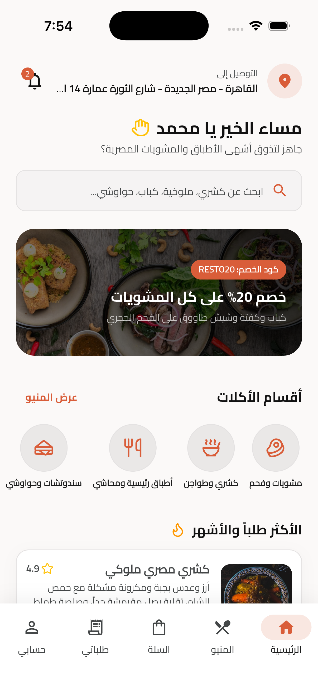
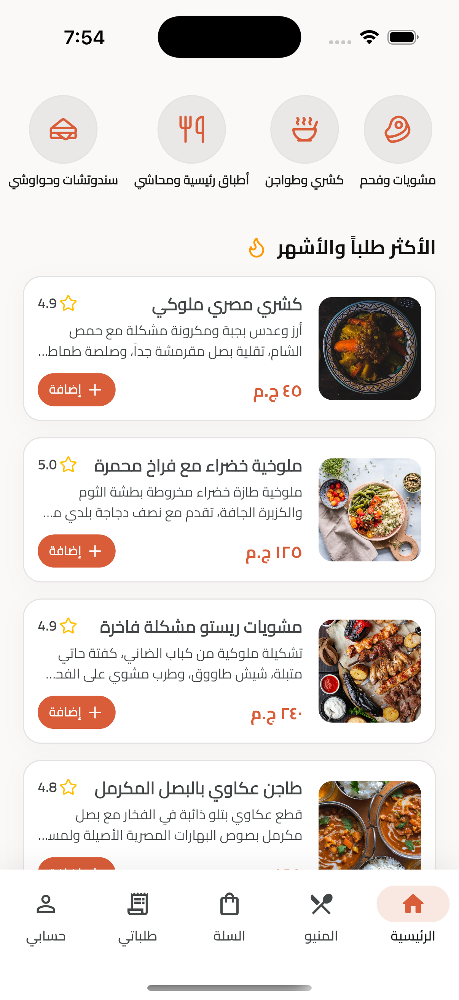
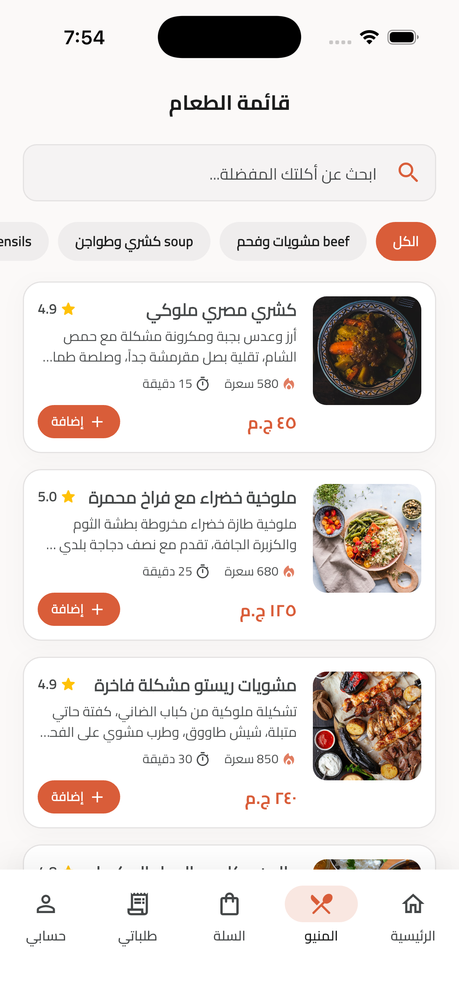
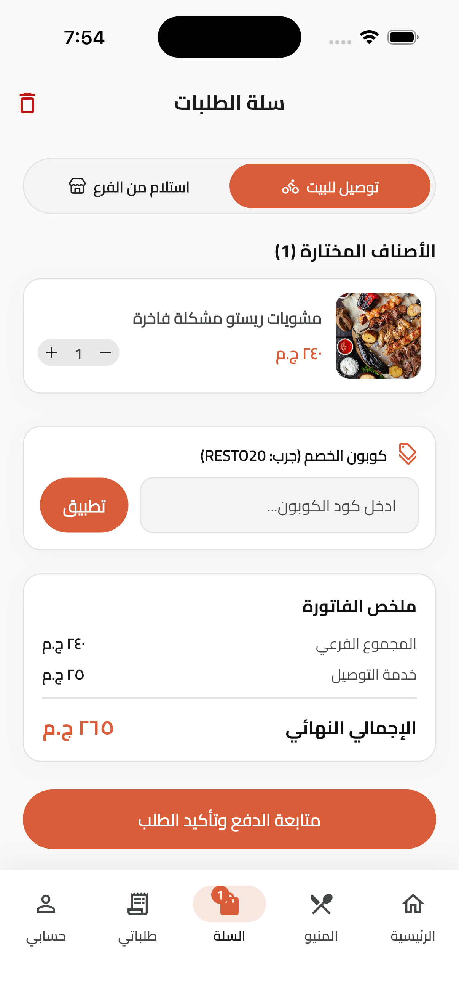
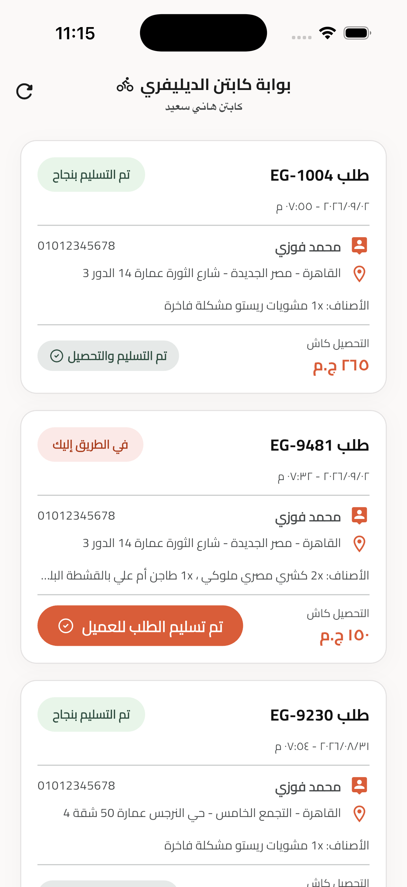
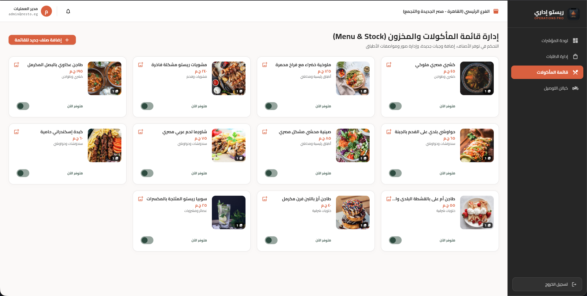
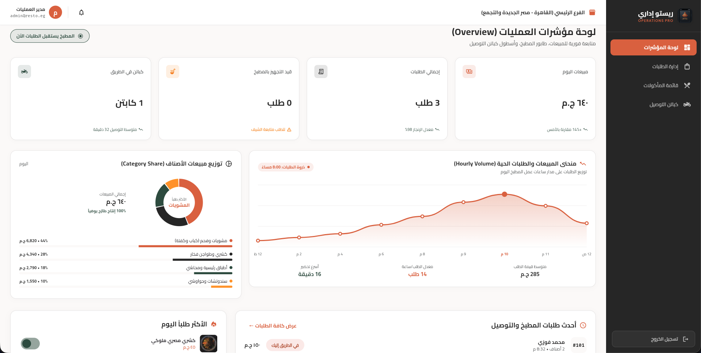
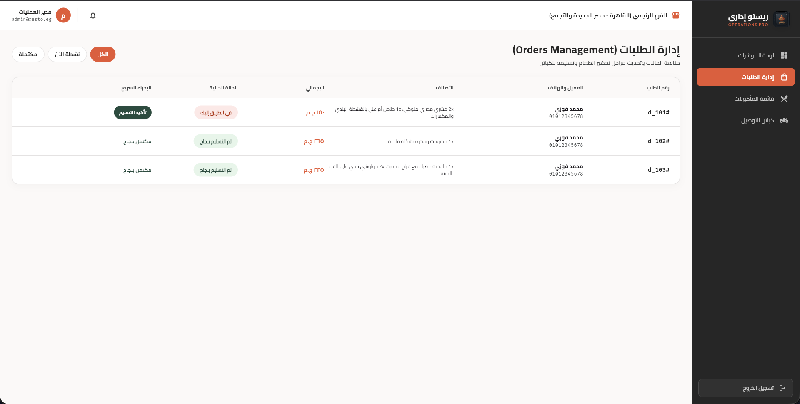
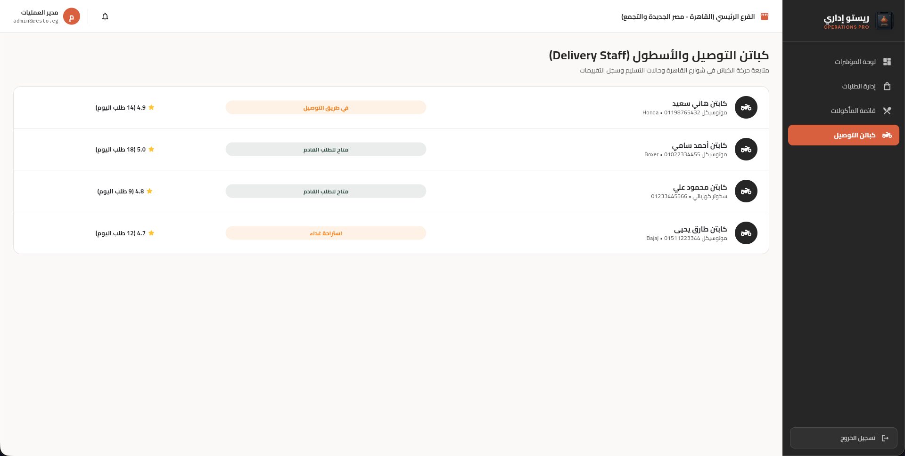

# Resto (ريستو) — Gourmet Egyptian Restaurant Monorepo

Enterprise-grade **Melos Monorepo** for **Resto (ريستو)**, a high-end Egyptian gourmet restaurant and food delivery ecosystem built with Flutter, Clean Architecture, and the **Culinary Heritage** design system.

---

## 📱 Mobile App Showcase (`resto_app`)

The **Resto Mobile Application** delivers a seamless digital dining experience for customers and real-time order dispatch for delivery captains.

| Home & Offers | Gourmet Menu | Dish Customization | Live Tracking |
| :---: | :---: | :---: | :---: |
|  |  |  |  |

### 🚴‍♂️ Delivery Captain Portal
| Captain Dispatch Screen | Order Fulfillment |
| :---: | :---: |
|  | Real-time status updates & customer address navigation |

---

## 💻 Web Operations Admin Dashboard (`resto_admin_web`)

The **Resto Operations Dashboard** provides restaurant managers and kitchen staff with real-time operational analytics, kitchen queue management, multi-photo menu editing, and 2-step TOTP authentication.

### 📈 Live Analytics & Kitchen Queue


### 📦 Order Status & Kitchen Dispatch


### 🍱 Menu & Multi-Photo Management
| Menu & Stock Controls | Add Dish Form | Multi-Photo Gallery |
| :---: | :---: | :---: |
|  |  |  |

---

## 🏛️ Workspace Architecture

```text
resto/
├── packages/
│   ├── resto_core/          # Shared models, design tokens, mock API & TOTP engine
│   ├── resto_app/           # Mobile app for Customers & Delivery Captains (iOS & Android)
│   ├── resto_admin_web/     # Operations Web Dashboard with 2-Step TOTP Authentication
│   └── resto_landing_page/  # Public marketing Landing Page for regular customers
├── screenshots/             # High-resolution screenshots of mobile app & web dashboard
├── docs/
│   └── PRD_RESTO_AR.md      # Comprehensive Product Requirements Document (in Arabic)
├── melos.yaml               # Melos workspace scripts & package configuration
└── pubspec.yaml             # Central Dart 3.5+ workspace manifest
```

---

## 🔑 Demo Credentials & Access Control

The ecosystem enforces strict role-based access control (RBAC). Logging in automatically routes users to their designated interface:

| Role | Email | Password | Additional 2FA / Verification | Target Package | Redirect Route |
| :--- | :--- | :--- | :--- | :--- | :--- |
| **Customer (عميل)** | `mohamed@resto.eg` | Any password (e.g. `123456`) | None (Direct login) | `resto_app` | `/customer/home` |
| **Driver (كابتن)** | `driver@resto.eg` | Any password (e.g. `123456`) | None (Role guard) | `resto_app` | `/driver/orders` |
| **Admin (مدير العمليات)** | `admin@resto.eg` | Any password (e.g. `123456`) | **6-digit TOTP Code** (Google Authenticator) | `resto_admin_web` | `/admin/dashboard` |

---

## ⚡ Quick Start (Melos Commands)

Run these commands from the monorepo root directory:

```bash
# 1. Bootstrap and link all packages
melos bootstrap

# 2. Run automated tests across all packages
melos run test

# 3. Analyze codebase for lint and quality
melos run analyze
```

---

## 🚀 How to Run Applications

### 1. Mobile App (`resto_app`):
```bash
cd packages/resto_app
flutter run
# Target specific platform:
flutter run -d android
flutter run -d ios
```

### 2. Admin Operations Dashboard (`resto_admin_web`):
```bash
cd packages/resto_admin_web
flutter run -d chrome
```
*Login with `admin@resto.eg`, then use the live 6-digit TOTP code displayed on screen or scan with Google Authenticator.*

### 3. Public Landing Page (`resto_landing_page`):
```bash
cd packages/resto_landing_page
flutter run -d chrome
```

---

## 🎨 Design System & Branding (Culinary Heritage)

- **Palette:** Primary Charcoal (`#262626`), Terracotta Clay (`#D95D39`), Warm Cream (`#FBF9F8`), Forest Green (`#2D4B3E`).
- **Typography:** Cairo font for Egyptian Arabic headings & body; Literata and Plus Jakarta Sans for numerals and branding.
- **Icons:** 100% unified Lucide Icons (`lucide_icons_flutter`) replacing emojis.
- **Brand Assets:** Custom luxury logo and launcher icons stored in `packages/resto_core/assets/images/`.
