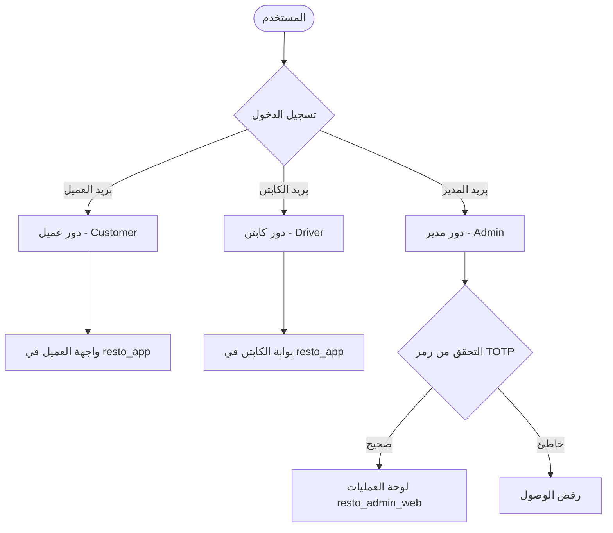

# وثيقة متطلبات المنتج (PRD) — نظام ريستو (Resto)

**اسم المشروع:** ريستو (Resto) — تجربة المذاق المصري الأصيل  
**نوع المنظومة:** Melos Monorepo متكامل (تطبيق موبايل هجين، لوحة عمليات ويب، موقع تعريفي، وحزمة نواة مشتركة)  
**الإصدار:** 2.0  
**التاريخ:** سبتمبر 2026  
**اللغة المعتمدة:** العربية المصرية (Egyptian Arabic - RTL فقط)  

---

## ١. الرؤية ونظرة عامة على النظام (Executive Summary)

منظومة **ريستو (Resto)** هي منصة تقنية متكاملة مخصصة لقطاع المطاعم والمأكولات المصرية الفاخرة (المشويات على الفحم، الطواجن الفخارية، المحاشي، والحلويات الشرقية). تهدف المنظومة إلى إدارة دورة حياة الطلب بالكامل بدءاً من جذب العملاء عبر موقع الهبوط التسويقي، ومروراً بطلب وتتبع الطعام عبر تطبيق الهاتف، وحتى إدارة المطبخ والأسطول والمبيعات عبر لوحة تحكم عمليات الويب المخصصة لمدير النظام.

تم بناء المنظومة بهندسة معمارية عصرية تعتمد على **Melos Monorepo** و **Dart 3.5+ Pub Workspaces** لضمان فصل المهام وتأمين البيئة وتقليص أحجام التحميل على مختلف المنصات، مع الالتزام التام بنظام التصميم الرفيع **Culinary Heritage**.

---

## ٢. الهيكل المعماري للنظام (Monorepo Architecture)

يتكون المشروع من مستودع موحد (Monorepo) ينقسم إلى 4 حزم رئيسية (`packages/`):

```text
resto/
├── packages/
│   ├── resto_core/          # النواة المشتركة (Design System, Models, Mock API, TOTP Engine)
│   ├── resto_app/           # تطبيق الهاتف (للعملاء وكباتن التوصيل - Android & iOS)
│   ├── resto_admin_web/     # لوحة تحكم العمليات للويب (Dashboard + TOTP 2FA)
│   └── resto_landing_page/  # الموقع التعريفي والتسويقي للويب (Landing Page)
├── melos.yaml               # سكريبتات وأوامر Melos لإدارة الحزم
└── pubspec.yaml             # إعدادات الـ Workspace المركزية
```

### ٢.١ مواصفات الحزم التقنية:

| اسم الحزمة | المنصات المدعومة | الهدف الأساسي | أهم التقنيات |
| :--- | :--- | :--- | :--- |
| **`resto_core`** | Dart / Flutter All | النماذج، نظام التصميم، الـ Mock API، خوارزميات الـ TOTP، الأدوات المشتركة | `dio`, `equatable`, `otp`, `lucide_icons_flutter`, `google_fonts` |
| **`resto_app`** | Android, iOS | تطبيق الهاتف الموحد للعملاء وكباتن التوصيل مع عزل تام للمسارات | `flutter_bloc`, `go_router`, `shimmer`, `easy_localization` |
| **`resto_admin_web`** | Web Only (Desktop first) | لوحة تحكم وإدارة عمليات المطعم، المطبخ، الأسطول، والمبيعات | `flutter_bloc`, `otp (RFC 6238)`, `lucide_icons_flutter` |
| **`resto_landing_page`** | Web Only (Responsive) | موقع تعريفي تسويقي لدعوة الزوار لتحميل التطبيق من المتاجر | `google_fonts`, `url_launcher`, Responsive Flutter Web |

---

## ٣. نظام التصميم والهوية البصرية (Culinary Heritage Design System)

تم اعتماد لغة تصميم "Culinary Heritage" المستوحاة من دفء وأصالة الضيافة المصرية الفاخرة:

- **الألوان الأساسية:**
  - الفحم الفاخر (Primary Charcoal): `#262626`
  - طمي التيراكوتا الفخاري (Secondary Terracotta): `#D95D39`
  - كريمي دافئ ناعم (Surface Cream): `#FBF9F8`
  - أخضر الغابة الطازج (Success Forest Green): `#2D4B3E`
  - برتقالي التنبيه (Warning Orange): `#F57C00`
  - أحمر الطوارئ (Error Red): `#BA1A1A`
- **الخطوط والطباعة:**
  - خط **Cairo** للعناوين الرئيسية والواجهات العربية لضمان وضوح وقوة الهوية المصرية.
  - خط **Literata** و **Plus Jakarta Sans** للعلامة التجارية والأرقام بالإنجليزية والرموز البرمجية.
- **الأيقونات:** استبدال كامل للرموز التعبيرية التقليدية (Emojis) بأيقونات احترافية متناسقة من مكتبة **Lucide Icons** (`lucide_icons_flutter`).
- **المؤثرات والجماليات:** زوايا منحنية ناعمة (16px إلى 24px للبطاقات الرئيسية)، تأثير الوميض (Shimmer Effect) أثناء تحميل البيانات، ودعم الوضع الداكن (Dark Mode).

---

## ٤. أدوار المستخدمين والصلاحيات (User Roles & Access Control)

النظام مصمم بقواعد أمان صارمة تعزل واجهات المستخدمين وفق الأدوار دون أي إمكانية للتبديل العشوائي من داخل الواجهات:



### ٤.١ العميل (Customer) — تطبيق الموبايل (`resto_app`)
- **طريقة الوصول:** إنشاء حساب جديد أو تسجيل دخول عبر تطبيق الهاتف.
- **المميزات:**
  - تصفح المنيو الديناميكي للمأكولات المصرية (مشويات، طواجن، محاشي، شوربات، مقبلات، حلويات).
  - صفحة تفاصيل الصنف واختيار الإضافات وملاحظات التحضير الخاصة.
  - سلة مشتريات ذكية تدعم خيارين: (توصيل لباب البيت Delivery / استلام من الفرع Takeaway).
  - تطبيق كوبونات الخصم الترويجية (مثل `RESTO20` لخصم 20%).
  - تتبع حي وتفاعلي لحالة الطلب عبر 5 مراحل واضحة (تم الاستلام، في المطبخ، في الطريق مع الكابتن، تم التوصيل).
  - تقييم الطلب وإرسال الملاحظات والشكاوى.

### ٤.٢ كابتن التوصيل (Delivery Driver) — تطبيق الموبايل (`resto_app`)
- **طريقة الوصول:** حسابات منشأة مسبقاً من قِبل إدارة المطعم، ويتم تسليم بيانات الدخول للكابتن (لا يوجد زر تسجيل عام للكباتن).
- **المميزات:**
  - توجيه فوري وتلقائي عند تسجيل الدخول إلى "بوابة الكباتن" (`/driver/orders`).
  - عرض الطلبات المسندة للكابتن فقط مع تفاصيل العنوان ورقم هاتف العميل.
  - أزرار تحديث حالة التوصيل السريعة: "استلام من المطبخ"، "بدء خط السير"، "تم تسليم الطلب وتحصيل الكاش".
  - ملخص الأرباح اليومية وعدد الطلبات المنجزة وسجل التقييمات.

### ٤.٣ مدير النظام والعمليات (Admin) — لوحة الويب (`resto_admin_web`)
- **طريقة الوصول:** عبر متصفح الويب المكتبي فقط، ومحمية بـ **نظام التحقق الثنائي بخطوتين (TOTP 2FA)**.
- **المميزات:**
  - **مؤشرات العمليات الحية (Overview):** مبيعات اليوم بالجنيه المصري، معدل الطلبات، طابور المطبخ النشط، وتتبع الكباتن.
  - **إدارة الطلبات (Orders Management):** جدول بيانات تفاعلي لعرض كافة الطلبات مع إمكانية تحويل الحالة بضغطة زر (إرسال للمطبخ، تسليم للكابتن، تأكيد التسليم).
  - **إدارة المنيو والمخزون (Menu Management):** تفعيل أو تعطيل توفر الأصناف في المطبخ فورياً لمنع طلب الأصناف النافذة.
  - **إدارة أسطول الكباتن (Delivery Fleet):** مراقبة نشاط الكباتن وأرقام هواتفهم وسجل التقييمات.

---

## ٥. منظومة الأمان والمصادقة متعددة الخطوات (Security & TOTP Authentication)

لحماية بيانات مبيعات وعمليات المطعم الحساسة، تم تطبيق نظام مصادقة خالي من أي تكاليف تشغيلية (Zero SMS/Email Cost) وفق مواصفة **RFC 6238**:

1. **الخطوة الأولى (Credentials):** يُدخل المدير البريد المعتمد (`admin@resto.eg`) وكلمة المرور.
2. **الخطوة الثانية (Time-based One-Time Password - TOTP):**
   - يُطلب من المدير إدخال رمز الأمان المكون من 6 أرقام والمتولد من تطبيقات المصادقة القياسية مثل **Google Authenticator** أو **Microsoft Authenticator**.
   - المفتاح السري المعتمد للحساب التجريبي: `JBSWY3DPEHPK3PXP`.
   - توفير نافذة مساعدة ذكية داخل واجهة الدخول تعرض الرمز المباشر مع عداد الثواني (30 ثانية) لتسهيل الفحص والتجربة السريعة.
   - دعم التسامح الزمني (Clock Skew Tolerance) لفرق التوقيت بين خادم الويب وجهاز المستخدم.

---

## ٦. الموقع التعريفي الرسمي (Landing Page — `resto_landing_page`)

موقع ويب تسويقي سريع وخفيف تم تصميمه خصيصاً لجذب الزوار وتعريفهم بالتطبيق:
- **قسم الـ Hero:** عنوان جذاب يعبر عن الأكلات المصرية، أزرار تحميل مباشرة بشعارات **App Store** و **Google Play**، ومجسم ثلاثي الأبعاد واقعي لتطبيق الهاتف.
- **قسم المميزات:** استعراض مميزات ريستو (مشويات فحم طازجة، تتبع حي، تغليف حراري عازل، دفع نقدي وإلكتروني).
- **معرض الأطباق الشهيرة:** بطاقات فاخرة لأشهر أطباق المطعم مع الأسعار بالجنيه المصري.
- **قسم الكباتن:** دعوة سائقي الموتوسيكلات والسكوتر للانضمام لأسطول التوصيل.
- **زر بوابة الإدارة:** وصول سلس لمسؤولي المطعم للانتقال إلى لوحة الـ Admin.

---

## ٧. بيانات الدخول التجريبية (Demo Accounts & Credentials)

| الدور (Role) | البريد الإلكتروني (Email) | كلمة المرور (Password) | آلية الدخول الإضافية | المنصة |
| :--- | :--- | :--- | :--- | :--- |
| **عميل (Customer)** | `mohamed@resto.eg` | أي كلمة مرور | لا يوجد (دخول مباشر) | تطبيق الهاتف (`resto_app`) |
| **كابتن توصيل (Driver)** | `driver@resto.eg` | أي كلمة مرور | لا يوجد (توجيه فوري لبوابة الكابتن) | تطبيق الهاتف (`resto_app`) |
| **مدير النظام (Admin)** | `admin@resto.eg` | أي كلمة مرور | رمز TOTP من Google Authenticator أو الرمز المباشر | لوحة الويب (`resto_admin_web`) |

---

## ٨. خطة الصيانة والتطوير المستقبلي

1. ربط واجهات الـ Mock API الحالية بقواعد بيانات حقيقية (Supabase أو PostgreSQL مع REST API).
2. إتاحة إمكانية إضافة وحذف وجبات جديدة ورفع صور الأطباق من داخل لوحة المنيو.
3. دمج خرائط Google Maps الحية في شاشة تتبع الكابتن بدلاً من المحاكاة الإحداثية.
4. إطلاق إشعارات الـ Push عبر Firebase Cloud Messaging (FCM).
